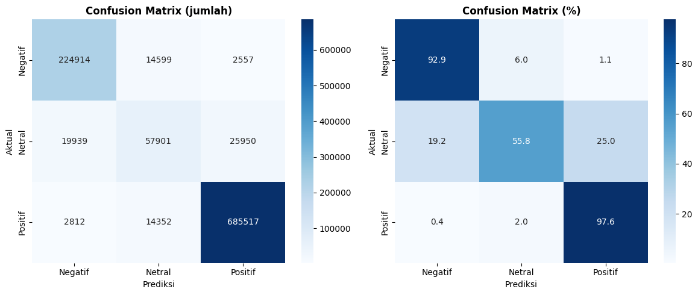

# Analisis Sentimen Ulasan Yelp menggunakan DistilBERT dan Apache Spark


Pipeline end-to-end klasifikasi sentimen pada dataset ulasan Yelp menggunakan Apache Spark untuk pemrosesan data skala besar dan DistilBERT untuk fine-tuning model deep learning.

---

## Ringkasan

| | |
|---|---|
| **Dataset** | 6.99 juta ulasan Yelp (review + business + user) |
| **Task** | Klasifikasi sentimen 3 kelas: Negatif / Netral / Positif |
| **Model** | `distilbert-base-uncased` fine-tuned |
| **Train set** | 4,893,189 sampel (70%) |
| **Accuracy** | **92.35%** pada 1,048,541 sampel test |
| **F1-weighted** | **0.9207** |

---

## Struktur Direktori

```
big-data-ai-sentiment/
├── notebooks/
│   ├── 01_spark_pipeline.ipynb
│   ├── 02_eda.ipynb
│   ├── 03_preprocessing.ipynb
│   ├── 04_model_distilbert.ipynb
│   └── 05_model_analysis.ipynb
├── outputs/
│   ├── figures/          # 20 visualisasi (EDA + training + evaluasi)
│   └── metrics/          # distilbert_metrics.json + prediction cache
├── models/distilbert/    # Model weights (via Git LFS)
└── docs/                 # Dokumen referensi dataset
```

---

## Pipeline

| # | Notebook | Deskripsi |
|---|----------|-----------|
| 01 | `01_spark_pipeline.ipynb` | Load + join 3 file JSON Yelp (~8 GB), encoding label bintang → sentimen, output Parquet |
| 02 | `02_eda.ipynb` | EDA pada 6.99M baris: distribusi sentimen, tren waktu, analisis teks, geografi, word cloud |
| 03 | `03_preprocessing.ipynb` | Cleaning teks, analisis panjang token, stratified split 70/15/15 |
| 04 | `04_model_distilbert.ipynb` | Fine-tuning DistilBERT 3 epoch pada 4.89M training samples |
| 05 | `05_model_analysis.ipynb` | Analisis mendalam: per-class metrics, error analysis, confidence dist, akurasi per panjang teks |

### Label Encoding
| Bintang | Label | Kelas |
|---------|-------|-------|
| 1 – 2 ★ | 0 | Negatif |
| 3 ★ | 1 | Netral |
| 4 – 5 ★ | 2 | Positif |

---

## Hasil Model

### Metrik Keseluruhan

| Metrik | Validasi | Test |
|--------|----------|------|
| Accuracy | 92.36% | 92.35% |
| F1-weighted | 0.9209 | 0.9207 |
| F1-macro | 0.8315 | 0.8312 |
| Loss | 0.2525 | 0.2525 |

### Per Kelas (Test Set)

| Kelas | Precision | Recall | F1 |
|-------|-----------|--------|----|
| Negatif | 0.91 | 0.93 | 0.92 |
| Netral | 0.67 | 0.56 | 0.61 |
| Positif | 0.96 | 0.98 | 0.97 |

### Confusion Matrix



Model paling lemah pada kelas **Netral** — banyak yang salah diklasifikasikan sebagai Positif (25,950 kasus dari 103,790 sampel Netral). Ini umum terjadi pada kelas minoritas yang ambigu secara linguistik.

---

## Requirements

```
Python 3.8+
Java 8+ (untuk Apache Spark)

pip install pyspark==3.3.2 transformers datasets torch accelerate scikit-learn matplotlib seaborn wordcloud
```

**Hardware yang digunakan:**
- GPU: NVIDIA RTX 3060 Laptop (6 GB VRAM), fp16 enabled
- RAM: 16 GB+
- Storage: ~15 GB untuk data mentah + processed

> **Catatan Spark:** Jika drive sistem (C:) penuh, tambahkan konfigurasi ini di SparkSession:
> ```python
> .config("spark.local.dir", "D:/spark-temp")
> ```

---

## Cara Menjalankan

Jalankan notebook **secara berurutan**:

```
01 → 02 → 03 → 04 → 05
```

1. Download [Yelp Open Dataset](https://www.yelp.com/dataset) dan letakkan di `data/raw/`
2. Jalankan `01_spark_pipeline.ipynb` untuk memproses data mentah
3. Lanjutkan ke notebook berikutnya sesuai urutan
4. Notebook 04 membutuhkan waktu training yang cukup lama (~30–60 jam untuk full dataset 4.89M sampel)
5. Notebook 05 menggunakan cache prediksi (`outputs/metrics/test_predictions.npz`) agar inferensi tidak perlu diulang

---

## Dataset

- **Sumber:** [Yelp Open Dataset](https://www.yelp.com/dataset)
- **File raw:** tidak di-track di repo (masuk `.gitignore`)
- **Distribusi kelas:** Positif 67% | Negatif 23% | Netral 10%
- **Periode:** 2005 – 2022
- **Geografi:** Mayoritas Amerika Serikat (PA, FL, LA) + sebagian Kanada
